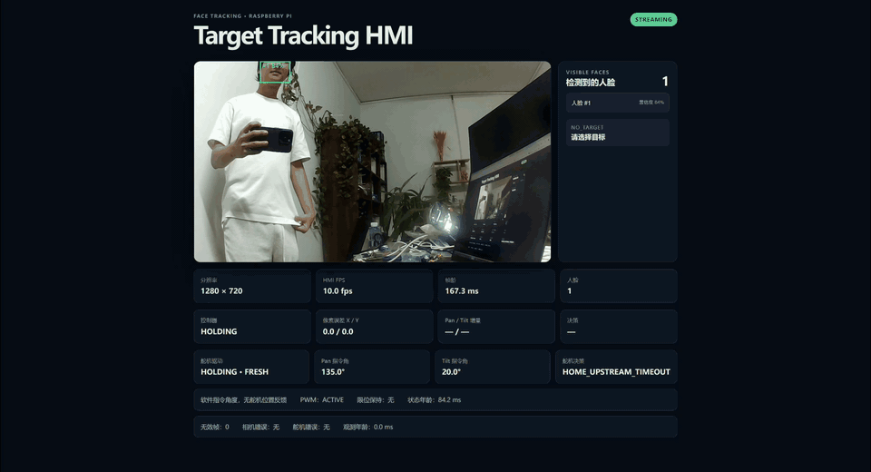
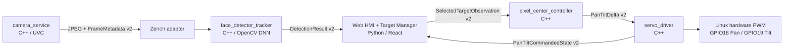

# Face Tracking

面向 Raspberry Pi 5 的模块化人脸跟踪与双轴云台系统。C++ 负责相机采集、人脸检测/短时跟踪、像素中心控制、真实舵机驱动和进程编排；Python/FastAPI + React 仅负责 Web HMI。默认通信中间件为 Zenoh 1.10，业务模块不依赖 Zenoh 或 ROS 2 类型，未来可通过独立 adapter 接入 ROS 2。



## 功能

- UVC 相机 1280×720 采集，latest-only 队列避免历史帧积压。
- OpenCV DNN + 固定 640 输入 ONNX 模型检测人脸，并生成短时稳定的 `track_id`。
- HMI 显示全部人脸；用户可点击画面检测框或列表选择目标，也可随时取消追踪。
- C++ pixel-center controller 根据目标中心与图像中心的误差输出受限角度增量。
- C++ servo driver 使用 Raspberry Pi 硬件 PWM 驱动 Pan/Tilt，并维护 HMI 所显示的软件指令角度。
- Camera、detector、controller、servo driver 和 HMI 由统一 bringup 启动和退出。

> HMI 中的 Pan/Tilt 是软件最后成功下发的指令值。三线舵机没有位置反馈，因此该数值不代表舵机已经到位。

## 架构



模块职责：

- `modules/face_tracking_schemas`：中间件无关 DTO、校验、Protobuf v2 schema/codec。
- `modules/camera_service`：UVC 采集、最新帧槽、JPEG 编码、限频和重连。
- `modules/face_detector_tracker`：ONNX 推理、YOLO 后处理、NMS 和稳定短时人脸轨迹。
- `modules/web_hmi_target_manager`：FastAPI 状态/transport、Zenoh adapter 与 React HMI。
- `modules/pixel_center_controller`：像素误差、死区、P 控制、时效和重复/乱序保护。
- `modules/servo_driver`：指令校验、角度累计、软限位、硬件 PWM 和 commanded state。
- `adapters/zenoh`：唯一允许在 C++ 中引用 Zenoh 类型的区域。
- `modules/pan_tilt_bringup`：启动五个子进程、信号处理和统一退出。

## 硬件连接与安全范围

| 轴 | 舵机 | BCM GPIO | 物理针脚 | 硬件 PWM | 追踪/测试范围 | Home |
|---|---|---:|---:|---|---:|---:|
| 下部 Pan | 270°位置舵机 | GPIO18 | Pin 12 | PWM0 channel 2 | 100°–170° | 135° |
| 上部 Tilt | 180°位置舵机 | GPIO19 | Pin 35 | PWM0 channel 3 | 15°–45° | 20° |

选择 GPIO18/GPIO19 是因为它们在 40-pin header 上分别提供独立硬件 PWM 通道。内核 PWM 外设能够持续输出稳定的 50 Hz 波形，避免此前 GPIO17/GPIO27 用户态软件定时可能引入的脉冲抖动。两针脚不可同时用于 I2S/音频。`setup.sh` 会配置：

```text
dtoverlay=pwm-2chan,pin=18,func=2,pin2=19,func2=2
```

两轴使用独立合规的舵机电源并与 Raspberry Pi 共地，不要由 GPIO 给舵机供电。候选角越过软限位时，该轴保持当前角度而非夹紧到边界；另一轴仍可更新。生产安装的两轴追踪增量方向均已反转，但绝对 Home 和 sweep 测试的脉宽映射不受影响。

安全状态机：

- `DEADBAND`、`MISSING_HOLD` 和单次 `STALE`：保持当前角度。
- 连续缺失第 1–9 个有效检测帧：保持；第 10 帧：`LOST` 并回 Home。
- 连续 5 秒没有新的有效 `APPLIED`、`DEADBAND` 或 `MISSING_HOLD` 控制数据：回 Home。
- controller 掉线或用户取消追踪（`NO_TARGET`）：立即回 Home。
- 超过 1.5 秒的积压运动命令：保持并拒绝，不驱动舵机，也不刷新 5 秒看门狗。

## 安装与启动

目标环境为 Raspberry Pi OS / Debian 12。进入克隆后的仓库根目录执行：

```bash
chmod +x setup.sh run.sh
./setup.sh
```

如果 `setup.sh` 新增了 PWM overlay，请先重启 Raspberry Pi。之后启动完整系统：

```bash
./run.sh
```

浏览器访问：

```text
http://<raspberry-pi-host>:8080
```

页面列出当前检测到的全部人脸。点击检测框或右侧列表开始追踪，点击“取消追踪”立即回 Home。画面中暂时无人时显示 0 张人脸属于正常状态。

可通过环境变量选择构建目录、配置 profile 或设备 ID：

```bash
FACE_TRACKING_BUILD_DIR=build-opencv412 \
FACE_TRACKING_CONFIG=config/default.yaml \
FACE_TRACKING_DEVICE_ID=pi5 \
./run.sh
```

`run.sh` 不会把 Zenoh 设置为开机自启。bringup 会安全复用 `zenohd.service`；只会接管当前用户拥有的手工 `zenohd`，不会停止无关监听器。按 `Ctrl+C` 或发送 `SIGTERM` 会统一停止五个子进程、停止舵机脉冲并释放 PWM。

## 独立舵机测试

必须先停止正式系统，避免 sweep 程序与 servo driver 同时占用 PWM2/PWM3：

```bash
FACE_TRACKING_BUILD_DIR=build-opencv412 \
build-opencv412/bin/face_tracking_servo_sweep_test \
config/default.yaml 1 50
```

程序从 Home 启动，在两轴配置限位内持续往返；参数 `1 50` 分别表示每步 1°、每 50 ms 更新一次。按 `Ctrl+C` 后停止并释放 PWM。

## 构建与测试

```bash
cmake -S . -B build -DCMAKE_BUILD_TYPE=Release
cmake --build build --parallel
ctest --test-dir build --output-on-failure

PYTHONPATH=modules/web_hmi_target_manager/service/src \
.venv/bin/python -m pytest modules/web_hmi_target_manager/service/tests

cd modules/web_hmi_target_manager/web
npm run typecheck
npm run build
```

运行完整系统后，可在另一个终端执行跨语言 Zenoh 冒烟测试：

```bash
FACE_TRACKING_E2E=1 \
PYTHONPATH=modules/web_hmi_target_manager/service/src \
.venv/bin/python -m pytest tests/integration/test_zenoh_v2.py
```

## Zenoh 接口

所有 key 均位于 `face_tracking/{device_id}`：

| Key 后缀 | 载荷/用途 |
|---|---|
| `camera/image` | JPEG payload + Protobuf v2 `FrameMetadata` attachment；拥塞丢旧帧 |
| `camera/status` | Protobuf v2 `CameraStatus` |
| `detections` | Protobuf v2 `DetectionResult`，含 tracker instance 与稳定 `track_id` |
| `target/selected` | HMI 发布的 Protobuf v2 `SelectedTargetObservation` |
| `pan_tilt/delta_cmd` | controller 发布的 Protobuf v2 `PanTiltDelta` |
| `pan_tilt/commanded_state` | servo driver 发布/queryable 的 Protobuf v2 `PanTiltCommandedState` |
| `diagnostics/detector` | Protobuf v2 `DetectorStatus` |
| `diagnostics/pixel_center_controller` | Protobuf v2 controller status |
| `liveliness/{component}` | camera、detector、controller、servo driver 的进程在线状态 |

业务模块只使用 DTO 与 typed settings。未来 ROS 2 adapter 应把 ROS message 转为同一组 DTO，不修改相机、检测、控制、舵机或 HMI 业务逻辑，也不进入默认构建依赖。

## 当前实机结果

- Camera：1280×720 约 29.9 FPS 采集、10 FPS JPEG 发布，无历史帧积压。
- C++ OpenCV DNN：无热限频时约 6.3–6.5 FPS；旧 Python/Ultralytics 约 2.26 FPS。
- 当前策略回归：全量 CTest 55/55、Python pytest 24/24（另 3 项按环境跳过）、前端 typecheck/build 通过；额外验证了超过 1.5 秒的积压 APPLIED 指令不得移动舵机。
- Pi 5 持续负载仍需要主动散热；接近固件软温度限制时 detector 可能降至约 3.4–4.3 FPS。

固定 ONNX 模型是唯一检测运行时模型；Torch 与 Ultralytics 不属于生产依赖。默认构建使用 OpenCV 4.12，因为 Debian 12 自带 OpenCV 4.6 无法执行该 YOLOv8 detection head。
